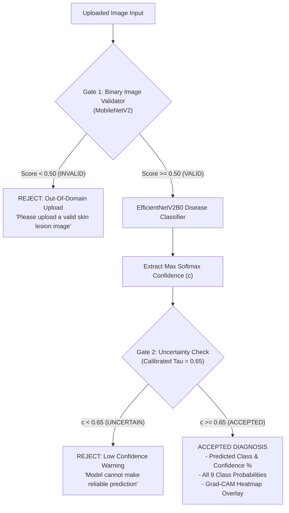

# 🔬 Multi-Class Skin Disease Classification System

[](https://www.python.org/)
[](https://www.tensorflow.org/)
[](https://keras.io/api/applications/efficientnet_v2/)
[](https://streamlit.io/)
[](LICENSE)

An end-to-end, production-grade Deep Learning system for classifying 9 distinct skin disease categories using **EfficientNetV2B0**, Transfer Learning, **Grad-CAM visual explainability**, **MobileNetV2 Out-of-Domain (OOD) image validation**, and **Empirical Uncertainty Rejection**.

---

## ⚠️ Medical Safety Disclaimer

> **IMPORTANT:**
> This application is an **educational and research demonstration project** and is **NOT a medical diagnostic tool**. Predictions generated by this system may be incorrect and should **NEVER** be used as a substitute for professional medical advice, diagnosis, or treatment. Always consult a qualified healthcare professional or dermatologist for any medical concerns.

---

## 📌 Key System Features

- **360° Dataset Quality Audit:** SHA-256 cryptographic hash duplicate detection, PIL image integrity verification, channel audits, and resolution distribution checks across 9,888 images.
- **Leakage-Safe Stratified Splitting:** 70% Train (6,921 images), 15% Validation (1,483 images), and 15% Test (1,484 images) splits with persistent CSV locking.
- **Efficient Input Data Pipeline:** Asynchronous multi-threaded `tf.data.Dataset` streaming with `batch(32)`, `shuffle`, and `prefetch(tf.data.AUTOTUNE)`.
- **Domain-Specific Data Augmentation:** GPU-accelerated Keras augmentation layers (RandomFlip, RandomRotation, RandomZoom, RandomContrast) applied strictly on training data only.
- **EfficientNetV2B0 Transfer Learning:** Built-in `[0, 255]` rescaling awareness (`include_preprocessing=True`) with a custom classification head (GAP + BatchNorm + Dense-256 + Dropout-0.3 + Softmax-9).
- **Class Imbalance Mitigation:** Dynamic loss penalization weights computed strictly on training data ($w_{\text{minority}} = 1.3563$).
- **Two-Stage Training Strategy:** Initial feature extraction head training followed by fine-tuning of the top 40 deep layers at a reduced learning rate ($\text{LR} = 10^{-5}$) with frozen BatchNormalization layers.
- **Grad-CAM Visual Explainability:** Gradient-weighted Class Activation Mapping displaying JET heatmap attention overlays.
- **Dual-Gate Guardrail Architecture:**
  1. *Gate 1 (MobileNetV2 Binary Validator):* Rejects out-of-domain uploads (selfies, animals, cars, screenshots, landscapes, random objects).
  2. *Gate 2 (Calibrated Uncertainty Rejection):* Rejects ambiguous in-domain predictions when confidence is below $\tau = 0.65$.
- **Interactive Streamlit Web UI:** Full-featured production dashboard (`app/app.py`).

---

## 📐 Dual-Gate Guardrail Architecture



---

## 📊 Dataset Overview (9 Verified Classes)

Audited on Kaggle dataset (*Balanced Skin Disease Image Classification Dataset*) containing **9,888 valid RGB images**:

| Class Index | Class Name | Total Images | Train (70%) | Val (15%) | Test (15%) | Class Weight |
|:---:|:---|:---:|:---:|:---:|:---:|:---:|
| `0` | Actinic keratosis | 1,137 | 796 | 170 | 171 | 0.9661 |
| `1` | Atopic Dermatitis | 1,136 | 795 | 170 | 171 | 0.9673 |
| `2` | Benign keratosis | 1,143 | 800 | 171 | 172 | 0.9613 |
| `3` | Dermatofibroma | 1,142 | 799 | 171 | 172 | 0.9625 |
| `4` | Melanocytic nevus | 1,129 | 790 | 170 | 169 | 0.9734 |
| `5` | Melanoma | 1,125 | 788 | 169 | 168 | 0.9759 |
| `6` | Squamous cell carcinoma | 1,132 | 792 | 170 | 170 | 0.9710 |
| `7` | Tinea Ringworm Candidiasis | 810 | 567 | 122 | 121 | **1.3563** |
| `8` | Vascular lesion | 1,134 | 794 | 170 | 170 | 0.9685 |
| **TOTAL** | **9 Classes** | **9,888** | **6,921** | **1,483** | **1,484** | — |

---

## 📈 Empirical Results & Training Progression

### Training Stages Comparison

| Training Stage | Base Model Status | Unfrozen Layers | Learning Rate | Train Acc (%) | Val Acc (%) | Val Loss |
|:---|:---:|:---:|:---:|:---:|:---:|:---:|
| **Feature Extraction (Phase 9)** | Frozen | 0 | $10^{-3}$ | 93.86% | 93.66% | 0.1774 |
| **Fine-Tuning (Phase 10)** | Unfrozen | Top 40 | $10^{-5}$ | **98.74%** | **95.89%** | **0.1030** |

---

### Final Untouched Test Set Benchmark (1,484 Unseen Images)

| Metric | Empirical Score |
|:---|:---:|
| **Test Accuracy** | **96.77%** |
| **Macro Precision** | **96.98%** |
| **Macro Recall** | **96.86%** |
| **Macro F1-Score** | **96.86%** |
| **Weighted F1-Score** | **96.76%** |

---

### Per-Class Test Performance Report

| Skin Disease Class | Precision | Recall | F1-Score | Support |
|:---|:---:|:---:|:---:|:---:|
| **Actinic keratosis** | 0.9699 | 0.9415 | 0.9555 | 171 |
| **Atopic Dermatitis** | **1.0000** | **1.0000** | **1.0000** | 171 |
| **Benign keratosis** | **1.0000** | 0.9942 | 0.9971 | 172 |
| **Dermatofibroma** | 0.8942 | 0.9826 | 0.9363 | 172 |
| **Melanocytic nevus** | 0.9379 | 0.9822 | 0.9595 | 169 |
| **Melanoma** | 0.9869 | 0.8988 | 0.9408 | 168 |
| **Squamous cell carcinoma** | 0.9512 | 0.9176 | 0.9341 | 170 |
| **Tinea Ringworm Candidiasis** | **1.0000** | **1.0000** | **1.0000** | 121 |
| **Vascular lesion** | 0.9884 | **1.0000** | 0.9942 | 170 |

---

## 🛠️ Project Directory Structure

```text
skin-disease-classification/
│
├── newtrain/                     # Dataset root directory (9 classes)
├── src/                          # Production Python Package
│   ├── __init__.py
│   ├── preprocessing.py          # Hashing, PIL verification, tf.data pipeline
│   ├── model.py                  # EfficientNetV2B0 model & Augmentation builders
│   ├── validator.py              # MobileNetV2 OOD Validator architecture
│   ├── gradcam.py                # Grad-CAM heatmap & JET overlay generators
│   └── inference.py              # Single Image Inference Engine
│
├── models/                       # Saved Production Models (.keras)
│   ├── disease_classifier.keras  # Main classifier (40.37 MB)
│   └── image_validator.keras     # OOD Validator (10.12 MB)
│
├── app/                          # Web UI Application
│   └── app.py                    # Streamlit Web Application
│
├── outputs/                      # Artifacts, Configs & Plots
│   ├── class_mapping.json
│   ├── uncertainty_config.json
│   ├── class_weights.json
│   ├── train_split.csv
│   ├── val_split.csv
│   ├── test_split.csv
│   ├── eda_class_distribution.png
│   ├── eda_image_dimensions.png
│   ├── phase9_training_curves.png
│   ├── phase10_fine_tuning_curves.png
│   ├── phase11_confusion_matrix.png
│   ├── phase11_classification_report.csv
│   ├── phase12_misclassified_samples.png
│   ├── phase13_gradcam_overlay.png
│   ├── phase14_validator_confusion_matrix.png
│   └── phase15_confidence_distribution.png
│
├── requirements.txt
├── .gitignore
└── README.md
```

---

## 🚀 Quick Start & Installation

### 1. Clone Repository & Setup Virtual Environment
```bash
git clone https://github.com/your-username/skin-disease-classification.git
cd skin-disease-classification

python -m venv .venv
# On Windows:
.venv\Scripts\activate
# On Linux/macOS:
source .venv/bin/activate
```

### 2. Install Dependencies
```bash
pip install -r requirements.txt
```

### 3. Run Streamlit Web Application
```bash
streamlit run app/app.py
```

---

## 🔮 Future Improvements

1. **Multi-Modal Integration:** Integrate patient metadata (age, sex, anatomical lesion site) with image feature embeddings using a Multi-Input Keras Functional Network.
2. **Dermoscopic vs Clinical Fine-Tuning:** Implement domain adaptation layers to handle both clinical smartphone photos and polarized dermoscopic images.
3. **ONNX Export:** Export models to ONNX / TensorFlow Lite format for real-time edge device inference.

---

## 📜 License
Distributed under the MIT License. See `LICENSE` for more information.
